# Kettlebell Guide: 19 Exercises, Ranked

## Contents

- [How the ranking works](#how-the-ranking-works)
- [The ranking at a glance](#the-ranking-at-a-glance)
- [Things every lift depends on](#things-every-lift-depends-on)
    - [The bell itself](#the-bell-itself)
    - [Grip](#grip)
    - [The hinge](#the-hinge)
    - [The rack](#the-rack)
    - [Breathing and bracing](#breathing-and-bracing)
- [S tier](#s-tier)
    - [Goblet squat](#goblet-squat)
    - [Press](#press)
    - [Full snatch](#full-snatch)
    - [Clean and jerk (long cycle)](#clean-and-jerk-long-cycle)
    - [Jerk](#jerk)
    - [Pendulum swing](#pendulum-swing)
- [A tier](#a-tier)
    - [Clean](#clean)
    - [Hardstyle swing](#hardstyle-swing)
    - [Half snatch](#half-snatch)
    - [Deadlift](#deadlift)
- [B tier](#b-tier)
    - [Lunge](#lunge)
    - [Row](#row)
- [C tier](#c-tier)
    - [Suitcase carry](#suitcase-carry)
    - [Thruster](#thruster)
- [D tier](#d-tier)
    - [Windmill](#windmill)
- [E tier](#e-tier)
    - [Bench press](#bench-press)
    - [Around the world](#around-the-world)
    - [Atlas swing](#atlas-swing)
    - [Turkish get-up](#turkish-get-up)
- [Putting it together](#putting-it-together)
- [Video library](#video-library)
- [Image credits](#image-credits)
- [Reference links](#reference-links)

---

## How the ranking works

Nineteen kettlebell exercises, sorted S down to E. The sort is by
return on the time you put in. An S lift earns a permanent place in
the week because it trains something large and trains it hard. An E
lift is not dangerous or useless. It just does not pay for the
minutes it costs when better options exist.

Three things push a lift up the list: how much muscle it recruits,
how much load it can carry once the technique is there, and whether
it teaches something the other lifts do not. Grinds like the press
and the squat load heavy. Ballistics like the snatch and the jerk
build power and drive the heart rate. Between those two families you
have most of what a kettlebell is good for.

Three things push a lift down: a small muscle group, a hard ceiling
on load, or a long time cost per useful rep. The Turkish get-up is
the clearest example. Nothing is wrong with it. One rep just takes
thirty seconds and trains less per minute than a set of swings, so it
lands at the bottom of a list sorted this way. Plenty of good coaches
rank it near the top for shoulder health and movement quality. If
that is what you want from it, move it up and ignore this ranking.

> This is a reference document, not medical advice. Ballistic lifts
> with a heavy iron ball are unforgiving of a sloppy back or a loose
> grip. If something hurts, stop, and get a coach to watch you before
> you add weight.

---

## The ranking at a glance

| Tier | Exercise | What it mainly buys you |
|---|---|---|
| **S** | [Goblet squat](#goblet-squat) | Legs, deep squat position, easy to load and easy to learn |
| **S** | [Press](#press) | Overhead strength, the single best kettlebell grind |
| **S** | [Full snatch](#full-snatch) | Whole body power, top conditioning lift |
| **S** | [Clean and jerk (long cycle)](#clean-and-jerk-long-cycle) | The most total work per minute of anything here |
| **S** | [Jerk](#jerk) | Leg drive and overhead lockout under real load |
| **S** | [Pendulum swing](#pendulum-swing) | Efficient hinge, the base under every sport lift |
| **A** | [Clean](#clean) | The gateway to every racked and overhead lift |
| **A** | [Hardstyle swing](#hardstyle-swing) | Glutes and hamstrings, hard, in very little time |
| **A** | [Half snatch](#half-snatch) | Snatch power with a friendlier hand and grip cost |
| **A** | [Deadlift](#deadlift) | Safe first hinge, teaches the pattern under load |
| **B** | [Lunge](#lunge) | Single leg strength and hip stability |
| **B** | [Row](#row) | Upper back pulling, the balance to all the pressing |
| **C** | [Suitcase carry](#suitcase-carry) | Grip and anti-side-bend core |
| **C** | [Thruster](#thruster) | Squat plus press in one gasping package |
| **D** | [Windmill](#windmill) | Hip and thoracic mobility with a load overhead |
| **E** | [Bench press](#bench-press) | Chest and triceps, but a barbell does it better |
| **E** | [Around the world](#around-the-world) | Warm-up, coordination, light core |
| **E** | [Atlas swing](#atlas-swing) | Rotational core and shoulder control |
| **E** | [Turkish get-up](#turkish-get-up) | Shoulder stability and ground-to-stand skill |

---

## Things every lift depends on

Learn these five once and the rest of the guide gets much shorter.

### The bell itself

A kettlebell has a handle, two corners where the handle bends down
into the horns, a window your hand passes through, a bell, and a flat
base. The vocabulary matters because the coaching cues use it. "Hand
in the corner" and "insert through the window" are instructions, not
poetry.

| Anatomy | Competition bells |
|---|---|
| 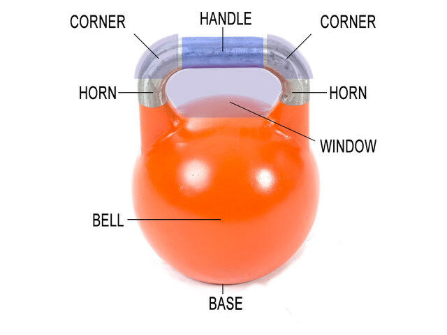 | 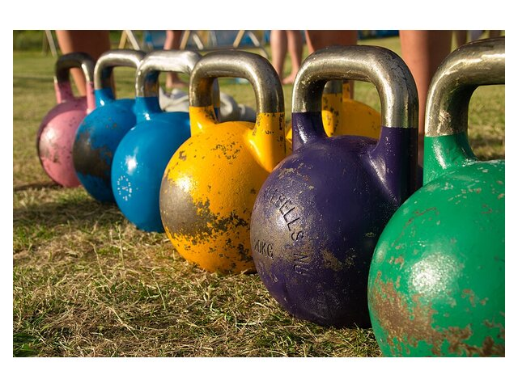 |

Cast iron bells grow as they get heavier. Competition bells are all
the same size no matter the weight, which is why kettlebell sport
lifters use them. If you plan to do long sets of jerks or snatches,
the steel competition bell is worth the money. For everything else,
cast iron is fine.

Starting weights that work for most people: 16 kg for a man,
8 to 12 kg for a woman. Buy the second bell before you buy a
heavier one.

### Grip

Two grips cover almost everything. For grinds you crush the handle.
For ballistics you hold it loosely, in the fingers rather than the
palm, and let the handle rotate as the bell travels. A death grip on
a hundred snatches is how you tear a callus off.

| Loose, in the fingers | Crushed, for grinds |
|---|---|
| 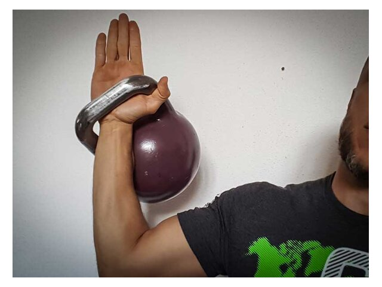 | 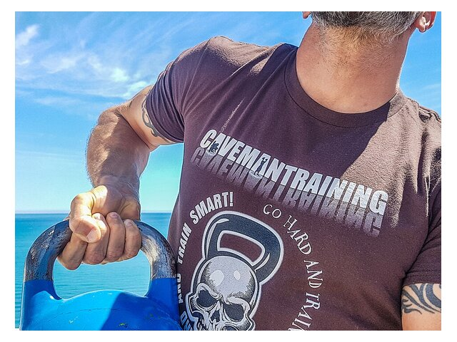 |

### The hinge

Push the hips back, let the torso tip forward to balance, keep the
shins close to vertical and the spine neutral. It is not a squat. The
knees bend a little because the hips travel back, not because you
told them to. You should feel the hamstrings load.

Every ballistic lift in this guide, plus the deadlift, is a hinge.

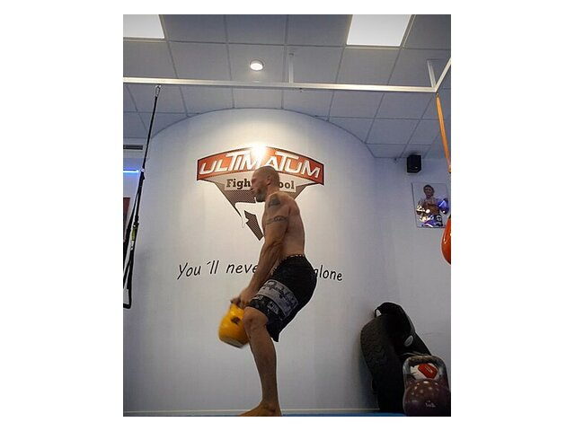

### The rack

Where the bell sits between a clean and a press. The handle rests on
the heel of the hand, the forearm is vertical or close to it, the
elbow is down and tucked into the ribs, and the bell rests on the
forearm and chest. Done right it is a resting position and you can
stand in it for a minute. Done wrong it is a shoulder held up by
muscle, and it burns.

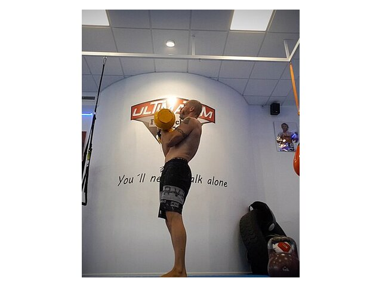

### Breathing and bracing

Grinds get a braced trunk and slow controlled breath, never a held
breath for a long set. Ballistics get a sharp exhale at the moment of
effort. On the swing that is a hiss or a grunt as the hips snap. On
the jerk it comes at the second dip. Long sets in kettlebell sport
use their own rhythm, usually two breaths per rep, and that is a
whole topic on its own.

---

## S tier

Six lifts. If you only ever did these, you would still have a
complete program.

### Goblet squat

Hold one bell by the horns at chest height and squat. That is the
whole exercise, and it is the fastest way to teach a person to squat
properly that anyone has found. The bell in front acts as a
counterweight, so the torso stays upright and the hips drop between
the ankles instead of shooting back.

**How to do it**

1. Hold the bell by the horns, close to the sternum, elbows down.
2. Feet about shoulder width, toes slightly out.
3. Sit straight down. Push the knees out as you descend.
4. Go until the elbows pass inside the knees, deeper if your hips
   allow it.
5. Stand up by driving the floor away. Keep the chest tall.

**Common mistakes.** Letting the bell drift away from the chest,
which turns it into a front raise. Heels lifting. Stopping at
parallel out of habit when you could go deeper.

Use the prying version as a warm-up: sit in the bottom and gently
push your knees out with your elbows for twenty or thirty seconds.
It opens the hips for everything that follows.

| Bottom position | Tutorial (click) |
|---|---|
| 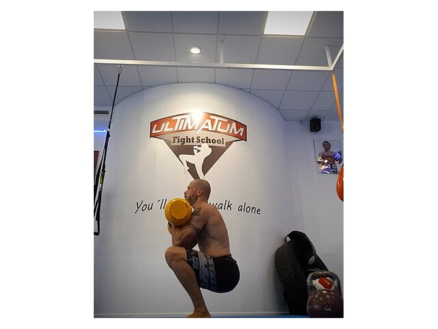 | [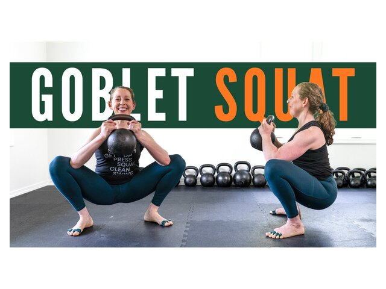](https://www.youtube.com/watch?v=FcTOmJW0G6U) |

### Press

The strict overhead press from the rack. No leg drive, no lean, no
bounce. It is the hardest kettlebell lift to cheat and the one that
tells you the most about your actual upper body strength.

**How to do it**

1. Clean the bell to the rack. A bad rack makes a bad press.
2. Squeeze the handle, brace the trunk, glutes tight.
3. Pull the elbow down and back slightly to start, then drive up.
4. The bell travels close to the head. The hand rotates as it goes.
5. Lock out with the biceps near the ear and the shoulder packed.
6. Lower under control back to the rack. That is half the work.

**Common mistakes.** Pressing from a collapsed rack. Leaning away
from the bell instead of standing tall. Rushing the negative. Losing
the glutes and letting the lower back arch.

The press punishes a weak clean more than anything else in this
guide. If you cannot rack it cleanly, fix that first.

[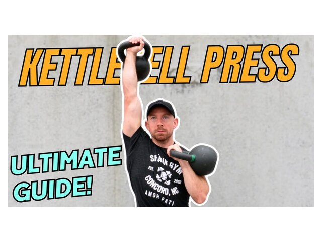](https://www.youtube.com/watch?v=78-gZ-y3vgA)

### Full snatch

Ground to overhead in one unbroken movement. It is the most athletic
thing you can do with a single bell, and it works the whole posterior
chain, the shoulder, the grip and the lungs at the same time.
Kettlebell sport calls the snatch the Tsar of the lifts and that is
about right.

**How to do it**

1. Hike the bell back between the legs like a football snap.
2. Snap the hips through hard. The bell floats up on that momentum.
3. As it rises, pull the elbow high and back, close to the body.
4. Punch the hand up and through the window as the bell passes
   the head. This is the whole trick.
5. Lock out overhead with a straight arm, no crash on the forearm.
6. Drop it back into the backswing by leading with the elbow.

**Common mistakes.** Muscling it up with the arm instead of the hips.
Letting the bell flip over and bang the wrist, which means you punched
late. Death gripping the handle and shredding your hands.

The physics are worth understanding. The hips give the bell kinetic
energy, and everything after that is you steering a moving object,
not lifting it.

| Snatch physics | Step by step (click) |
|---|---|
| 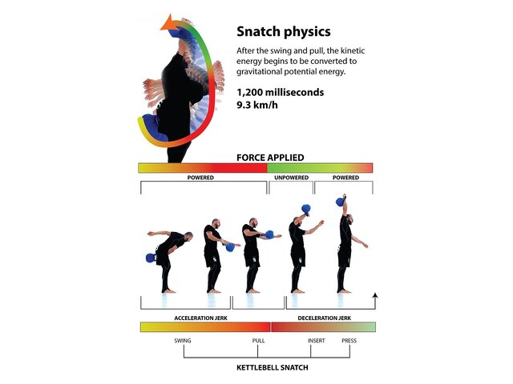 | [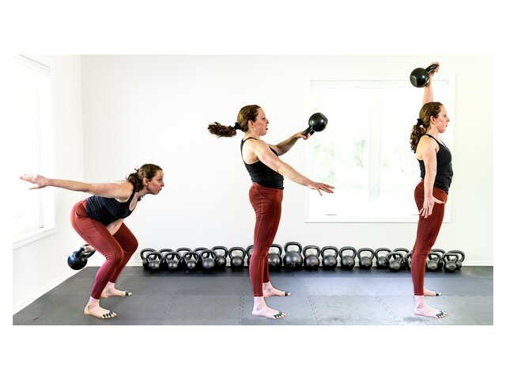](https://www.youtube.com/watch?v=fbm_zISdSbw) |

### Clean and jerk (long cycle)

Clean the bell or bells to the rack, jerk overhead, drop back to the
rack, drop back down, repeat. Long cycle is the flagship event of
kettlebell sport and it moves more total weight per minute than
anything else in this guide. Ten minutes of long cycle with two 24 kg
bells is a serious afternoon.

**How to do it**

1. Clean both bells to the rack from the backswing.
2. Settle. Breathe. The rack is a rest, so use it.
3. Dip at the knees, drive up, drop under, lock the bells overhead.
4. Fix the position for a beat with straight arms and locked knees.
5. Drop to the rack, absorb with the legs.
6. Drop to the backswing and clean again. The clean is what makes it
   the long cycle rather than the short.

**Common mistakes.** Rushing the rack and never recovering. Pressing
the bells out instead of jerking them. Bending the arms in the clean
and beating up your forearms.

| Drive out of the dip | Tutorial (click) |
|---|---|
| 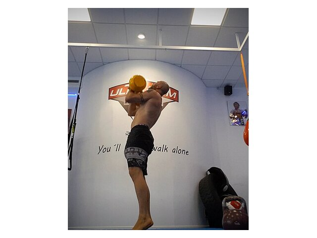 | [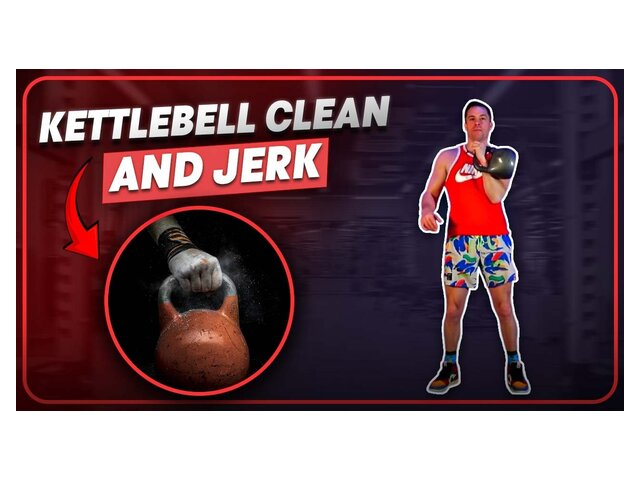](https://www.youtube.com/watch?v=KyQsweWeofc) |

### Jerk

The jerk on its own, without the clean between reps. From the rack,
you dip, drive, drop under, and catch the bells overhead on locked
arms. Roughly eighty percent of it is legs. The arms are there to
stop the bells, not to raise them.

**How to do it**

1. Start in a solid rack, elbows on the hips if you can get them there.
2. First dip: a short, fast bend at the knees. Heels stay down.
3. Drive: extend hard and let the bells leave the rack.
4. Second dip: drop your body under the bells and catch them locked.
5. Stand up. Fix overhead until the bells stop moving.
6. Drop back to the rack and absorb.

**Common mistakes.** Dipping too deep, which turns it into a slow
push press. Letting the elbows come off the body before the drive.
Catching with soft elbows.

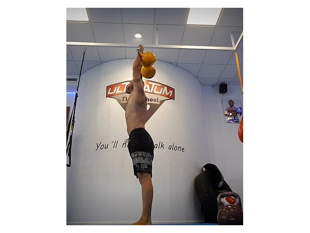

The two dips are what separates a jerk from a push press. Learn the
timing with one light bell before you touch two heavy ones.

[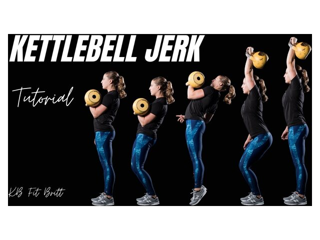](https://www.youtube.com/watch?v=2EWDneXMCgI)

### Pendulum swing

The kettlebell sport swing. The bell swings like a pendulum on a
string, and your job is to guide it rather than fight it. Compared to
the hardstyle swing it is lower, longer, and much cheaper in energy,
which is exactly the point when you have ten minutes of snatches to
get through.

**How to do it**

1. Start with the bell hanging, arm long and relaxed.
2. Let it fall into the backswing. Do not pull it back.
3. The arm stays connected to the body until the hips open.
4. Open the hips and let the bell float forward. Chest height is
   plenty, waist height is normal in a long set.
5. Follow it back down, absorb with the hips, repeat.

**Common mistakes.** Stopping the bell at the top like a hardstyle
swing. Gripping too hard. Hinging on a schedule instead of waiting
for the bell.

| Loaded backswing | GS swing tutorial (click) |
|---|---|
| 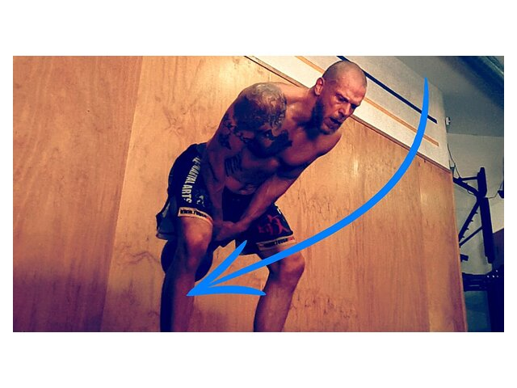 | [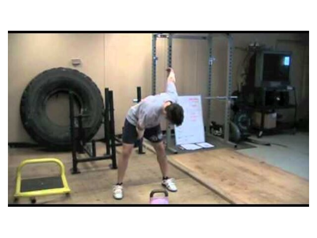](https://www.youtube.com/watch?v=-R7oJ2XUvcs) |

---

## A tier

Good lifts, all of them. They sit here because each one is either a
component of an S lift or a slightly narrower version of one.

### Clean

Floor or backswing to the rack in one move. Almost nobody does cleans
for their own sake, and yet the clean gates the press, the jerk, the
thruster, the racked squat and the long cycle. Learn it properly and
five other exercises get better.

**How to do it**

1. Hike the bell back, same as a swing.
2. Snap the hips and keep the elbow close to your side.
3. As the bell rises, guide it in an arc toward the shoulder.
4. Open the hand and let the handle rotate around it. Insert the
   hand through the window.
5. The bell settles onto the forearm quietly. If it bangs, you were
   late.
6. Return by pushing the bell away and letting it fall into the
   backswing.

**Common mistakes.** Curling it up with the arm. Letting the bell
travel too far out from the body, which is what causes the forearm
smack. Keeping the hand closed so the bell has to flip over your
fist.

| Correct hand insert | What too far out looks like |
|---|---|
| 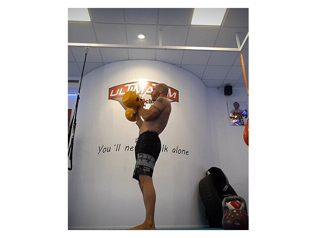 | 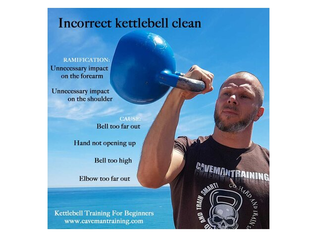 |

If the forearm is bruised, the fix is almost always a lighter bell and
a tighter arc, not a wrist guard.

[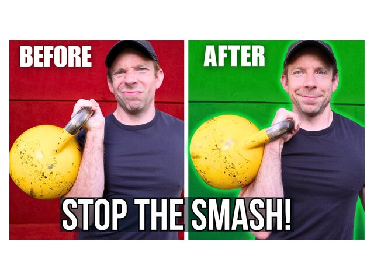](https://www.youtube.com/watch?v=rndZDA3vUnU)

### Hardstyle swing

The two-hand swing to chest height, with everything braced and the
hips snapping like a punch. It is the most efficient posterior chain
exercise in the world per minute spent. Ten sets of ten with a heavy
bell takes five minutes and leaves your glutes and hamstrings in no
doubt about what happened.

**How to do it**

1. Bell a foot in front of you. Hinge, grab it, tilt the handle back.
2. Hike it hard between the legs, above the knees.
3. Snap the hips forward. Glutes hard, abs hard, quads hard.
4. The bell floats to chest height on its own. The arms do nothing.
5. Let it fall. Wait for it. Hinge at the last moment.
6. Sharp exhale on every snap.

**Common mistakes.** Squatting instead of hinging. Lifting the bell
with the shoulders. Swinging above the head, which is a different
exercise and a worse one for most people. Rounding the back in the
backswing.

| Top of the swing | The full tutorial (click) |
|---|---|
| 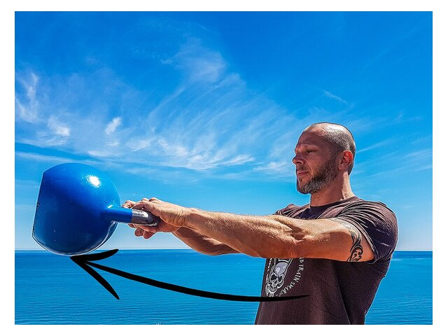 | [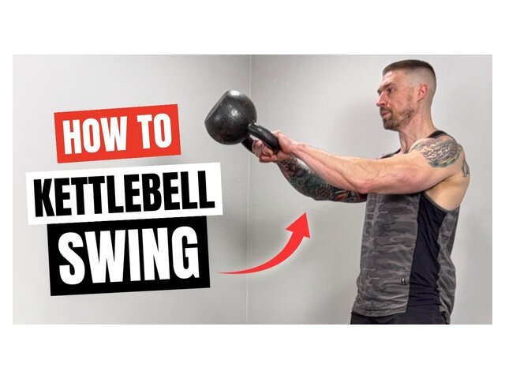](https://www.youtube.com/watch?v=ZYgRuQoh6Qc) |

### Half snatch

Snatch it up, then lower it to the rack instead of all the way down,
and clean it back overhead from there. You get most of the pull of a
full snatch with far less punishment on the hand, because the bell
does not travel through the full drop every rep.

Useful as an accessory to the full snatch, and useful in its own
right when your hands are torn up but you still want to train the
pull.

**How to do it**

1. Snatch the bell overhead as normal.
2. Instead of dropping it to the backswing, lower it to the rack.
3. From the rack, drop into the backswing and pull again.
4. Alternate arms whenever you want. It is a very forgiving lift.

**Common mistakes.** Pressing out of the rack rather than pulling.
Losing the vertical forearm on the way down.

| Pull | Lockout |
|---|---|
| 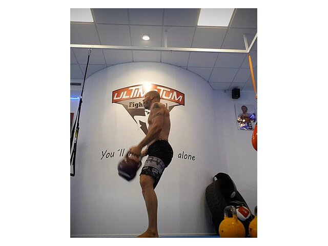 | 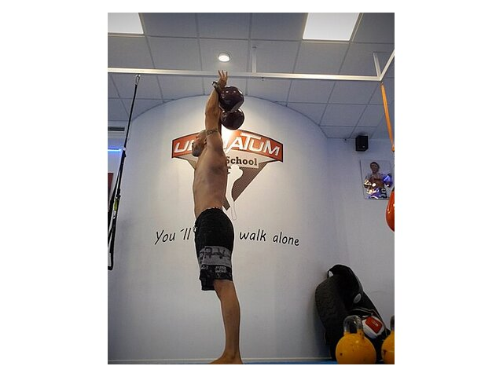 |

[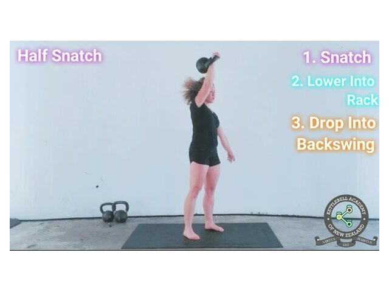](https://www.youtube.com/watch?v=UQb2A6qcTW8)

### Deadlift

Bell on the floor between the feet, hinge, stand up with it. This is
where a beginner should start, before any swing. It teaches the hinge
under load at a speed where you can feel what your back is doing.

Two bells, or one heavy bell held with both hands, and the load gets
respectable fast.

**How to do it**

1. Bell between the arches, feet hip width.
2. Push the hips back and reach down. Shins near vertical.
3. Flat back, chest proud, lats engaged so the shoulders do not round.
4. Push the floor away and stand tall. Squeeze the glutes at the top.
5. Hinge back down under control. Do not drop it.

**Common mistakes.** Squatting the weight up. Rounding the lower back
at the bottom. Hyperextending at the top and leaning back.

The single-leg version is worth adding once the two-leg version is
easy. It exposes hip stability problems you did not know you had.

[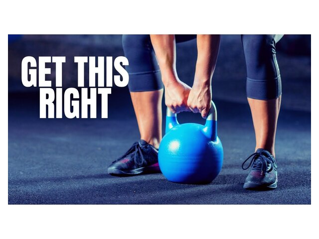](https://www.youtube.com/watch?v=-N4NjwW7bGA)

---

## B tier

Accessories. Add them when the S and A lifts are in place and you
want to fill a gap.

### Lunge

Split stance, back knee toward the floor, stand back up. Hold the
bell in the goblet position to learn it, in the rack to make it
harder and to load one side, or overhead if you want the shoulder
involved too.

Reverse lunges are kinder to the knees than forward lunges and easier
to balance. Start there.

**How to do it**

1. Hold the bell in the goblet or rack position.
2. Step one foot straight back.
3. Bend both knees. The back knee taps the floor lightly.
4. Push through the front heel to stand.
5. Keep the torso upright the whole time.

**Common mistakes.** Stepping back too short, which puts the front
knee far past the toes. Leaning forward. Letting the front knee cave
in.

The rack position version, one bell only, is the good one. The offset
load makes the trunk work to stop you tipping.

[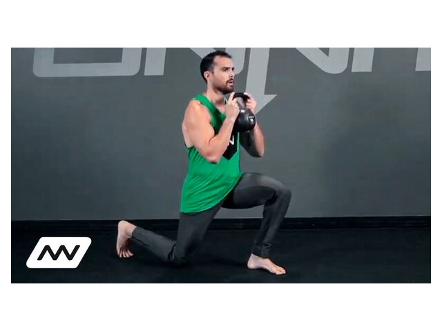](https://www.youtube.com/watch?v=gWN9epxFqX8)

### Row

Hinge over, pull the bell to the hip. This is the only real pulling
exercise on the list, and every other lift here is either a press or
a hinge, so it earns its place by balancing the program. It ranks B
rather than A because a pull-up bar or a barbell row does the same
job with more load.

**How to do it**

1. Hinge to roughly forty-five degrees, one hand braced on a bench
   or your own thigh.
2. Let the bell hang directly under the shoulder.
3. Pull the elbow back toward the hip. Lead with the elbow.
4. Squeeze the shoulder blade at the top, hold for a beat.
5. Lower under control to a full stretch.

**Common mistakes.** Yanking with the biceps. Rotating the torso to
help. Shrugging the shoulder toward the ear. Stopping the descent
early and never letting the lat stretch.

[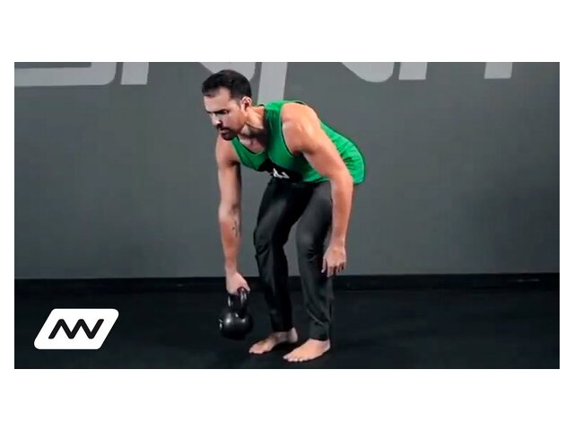](https://www.youtube.com/watch?v=8gg400ddt-g)

---

## C tier

Situational. Both are worth knowing and neither needs a regular slot.

### Suitcase carry

Pick up one bell, hold it at your side, walk. Your trunk spends the
whole walk stopping you from bending sideways, and your grip spends
it slowly failing. Simple, effective, and easy to bolt onto the end
of a session.

**How to do it**

1. Deadlift one bell to the side of your body.
2. Stand tall. Ribs down, shoulders level, both of them.
3. Walk with short controlled steps for thirty to sixty seconds.
4. Swap hands and repeat. Never do only one side.

**Common mistakes.** Leaning away from the bell, which defeats the
whole purpose. Hiking the loaded shoulder. Going so heavy the
technique falls apart in five steps.

It ranks C because it is a finisher, not a training block. Very good
at what it does and what it does is narrow.

[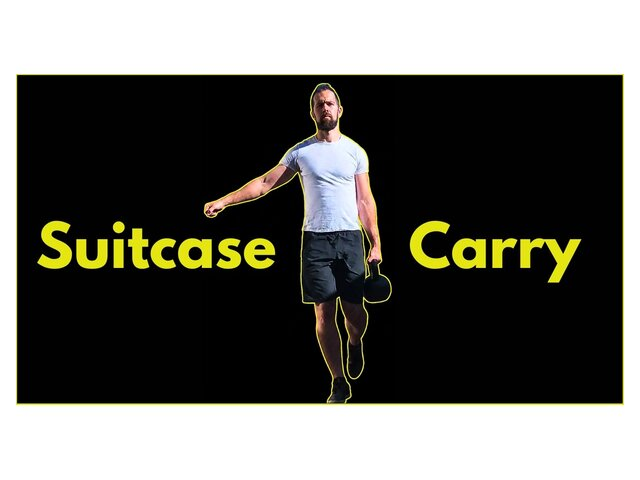](https://www.youtube.com/watch?v=m7iiTYfRy9A)

### Thruster

Front squat straight into an overhead press, with the leg drive
carrying the bell up. Brutal conditioning. The problem is that it is
a worse squat than the goblet squat and a worse press than the press,
so the only reason to do it is the gasping, which is a real reason
but a narrow one.

**How to do it**

1. Clean one or two bells to the rack.
2. Squat to depth, keeping the elbows tucked and the chest up.
3. Drive up out of the hole and let that momentum carry the bells.
4. Finish the movement with a press to lockout.
5. Lower to the rack and go straight into the next squat.

**Common mistakes.** Pausing between the squat and the press, which
throws away the free momentum. Going too heavy and turning it into a
slow grind. Losing the rack in the bottom of the squat.

[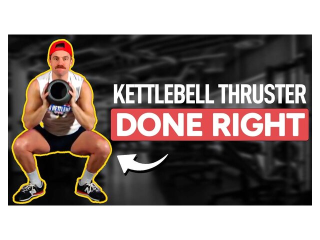](https://www.youtube.com/watch?v=n7jEYoIU9Zs)

---

## D tier

### Windmill

Bell locked out overhead, hips shifted to one side, torso rotating
and hinging down until the free hand reaches the floor. The bell
barely moves. You move underneath it.

It is genuinely good for hip and thoracic mobility and it does teach
a strong overhead shoulder. It sits at D because the load will always
be light relative to your real strength, and it takes a while to
learn. As mobility work it is excellent. As strength work it is not.

**How to do it**

1. Press or clean and press the bell overhead. Eyes on it.
2. Turn the feet about forty-five degrees away from the loaded arm.
3. Push the hip under the bell out to the side.
4. Keep the loaded arm vertical and the loaded leg straight. Hinge
   down, front knee soft.
5. Reach the free hand toward the floor along the front leg.
6. Come back up by driving the hip forward.

**Common mistakes.** Bending the loaded arm. Turning it into a side
bend instead of a hip shift and rotation. Losing sight of the bell.

Learn it with no weight, then with a shoe balanced on your fist,
then with a light bell. Rushing this one is how shoulders get hurt.

[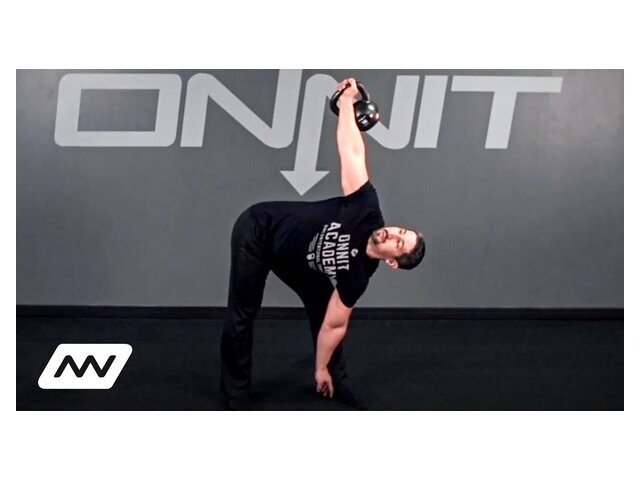](https://www.youtube.com/watch?v=ITSmgn_BQgY)

---

## E tier

Not bad exercises. Just not the ones to reach for first if your time
is limited.

### Bench press

Kettlebells make an awkward barbell. The offset load and the bell
resting against the forearm mean the wrist has to work hard and the
weight you can handle is well below what a barbell allows. If you
have barbells, use them for this.

What kettlebells do add: the floor press variation, which limits the
range of motion and is easy on cranky shoulders, and the crush grip
press, where you squeeze a single bell between both palms and the
chest works the whole time.

**How to do it (floor press)**

1. Lie down, one bell in each hand, elbows on the floor at 45 degrees.
2. Wrists straight, bells resting on the forearms.
3. Press up until the arms lock. Do not clash the bells.
4. Lower until the triceps touch the floor. Do not bounce.

**Common mistakes.** Bent wrists. Flaring the elbows to ninety
degrees. Bouncing the elbows off the floor.

[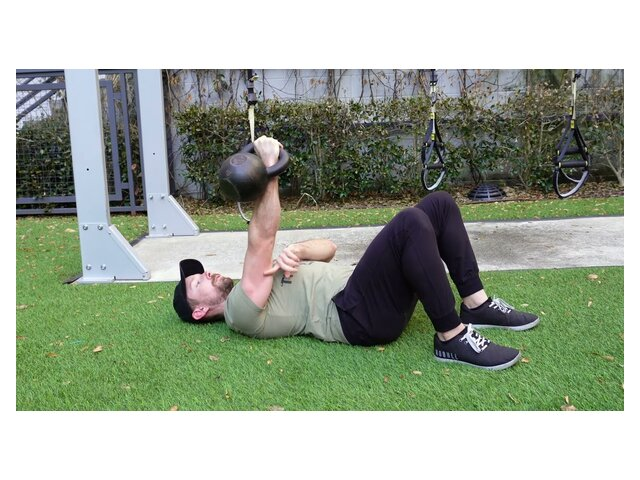](https://www.youtube.com/watch?v=4ULa6AJcjr8)

### Around the world

Pass the bell around your waist from hand to hand, in a circle. Nice
warm-up, decent coordination drill, mild core work. That is the whole
story. It cannot be loaded meaningfully, so it earns its place at the
start of a session and nowhere else.

Do not confuse it with the halo, which orbits the head and is a
better shoulder mobility drill.

**How to do it**

1. Stand tall, feet about hip width, core braced.
2. Pass the bell around the waist, handing it off in front and behind.
3. Keep the hips still. The bell moves, you do not.
4. Ten each direction, slowly. Speed makes it easier, not harder.

**Common mistakes.** Swaying the hips to help the bell along. Going
fast. Using a bell so heavy the handoff gets risky.

[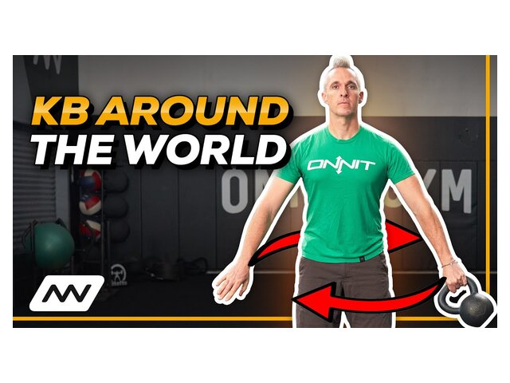](https://www.youtube.com/watch?v=N4mMVG8S5Kg)

### Atlas swing

Hold the bell by the horns and swing it in a figure of eight or a
circular arc across the body, overhead and around, resisting the
rotation the whole time. The obliques and the shoulders work hard for
ten to twenty reps.

Fun, and better than its reputation for rotational core work. It sits
in E for the same reason as around the world. You cannot load it, so
it will never build much.

**How to do it**

1. Hold the bell by the horns with both hands.
2. Swing it up and across, letting it travel around the head and
   shoulders in a controlled arc.
3. Resist the pull. Keep the hips and ribs facing forward.
4. Ten to twenty reps, then reverse the direction.

**Common mistakes.** Letting the torso rotate with the bell.
Going too heavy too early. Losing control behind the head.

[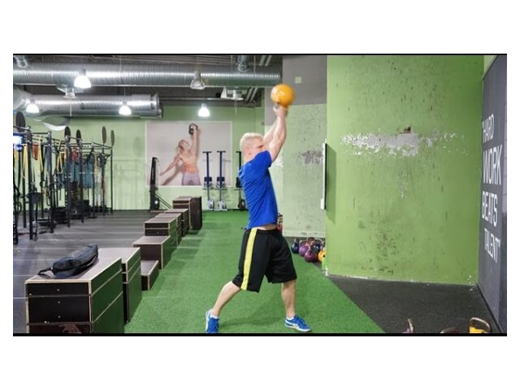](https://www.youtube.com/watch?v=ZXq_vq-F66c)

### Turkish get-up

Lie on your back with a bell locked out overhead, stand up without
letting it move, then reverse the whole thing. Roughly seven steps
each way, thirty seconds a rep, and every rep asks for total
concentration.

Nobody argues it is a bad exercise. It builds a very stable shoulder
and it exposes weak links you will not find anywhere else. The reason
it lands at the bottom of a list ranked by return per minute is
arithmetic: in the thirty seconds a get-up takes, you could do ten
heavy swings. Many coaches weight it differently and put it near the
top. Both positions are defensible.

**How to do it**

1. Roll to the bell, two hands on it, press it up. Eyes on it.
2. Same-side knee bent, foot flat. Free arm out at 45 degrees.
3. Roll up onto the free elbow.
4. Post up onto the free hand. Chest open.
5. Bridge the hips high.
6. Sweep the straight leg back under you into a half kneel.
7. Windshield wipe the back shin straight, then stand.
8. Reverse every step in order to get back down.

**Common mistakes.** Rushing. Taking your eyes off the bell in the
early steps. Letting the elbow bend. Doing them heavy before the
pattern is automatic.

| Overhead lockout under load | Step by step (click) |
|---|---|
| 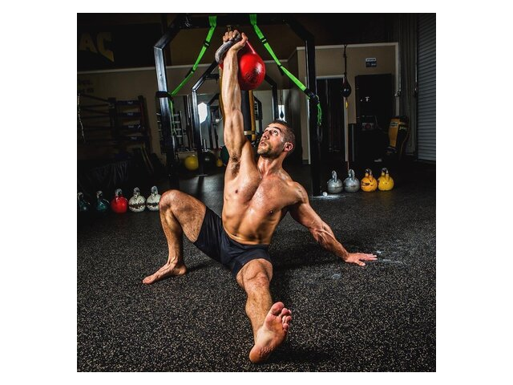 | [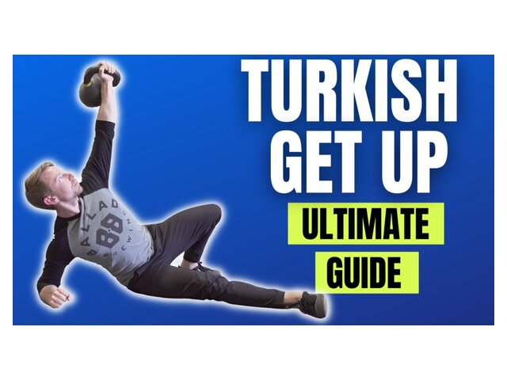](https://www.youtube.com/watch?v=5kb9Blkrj2w) |

---

## Putting it together

The tiers tell you what to train. They do not tell you how to
schedule it. Three templates that work:

**Two bells, three days a week, general strength.**
Day one: press, goblet squat, row. Day two: swings and snatches for
conditioning. Day three: clean and jerk ladders, lunges. Every
session opens with the prying goblet squat and a few halos.

**Minimum effective dose.**
Swings and get-ups, alternating, five days a week, thirty minutes
total. This is Pavel Tsatsouline's Simple and Sinister and it works
despite ignoring most of this list. Note that it leans hard on the
get-up, which this guide ranks last, and it still works. Rankings are
a starting point, not a law.

**Kettlebell sport.**
Long cycle and snatch, trained in timed sets that grow from two
minutes toward ten. Everything else in this guide becomes accessory
work. Buy competition bells before you commit to this.

Whatever you pick: press and pull in roughly equal amounts, hinge
more than you squat, and add weight slowly. Kettlebells jump 4 kg at
a time, which is a big jump on a press. Bridge the gaps with reps and
sets rather than waiting to muscle the next bell up.

---

## Video library

Every link verified in September 2026.

| Exercise | Video | Source |
|---|---|---|
| Goblet squat | [Kettlebell Goblet Squat: 1-Minute Complete Tutorial](https://www.youtube.com/watch?v=FcTOmJW0G6U) | Cat & Chau |
| Goblet squat | [Heavy Kettlebell Goblet Squat](https://www.youtube.com/watch?v=s64Ss68bABQ) | StrongFirst |
| Goblet squat | [Kettlebell Prying Goblet Squat](https://www.youtube.com/watch?v=TcXOrjCAyPg) | StrongFirst |
| Press | [Kettlebell Military Press (Ultimate Guide)](https://www.youtube.com/watch?v=78-gZ-y3vgA) | Zack Henderson |
| Press | [Kettlebell Military Press Tutorial](https://www.youtube.com/watch?v=iW-PGDQwmn8) | Mike Stehle |
| Press | [Kettlebell military press technique](https://www.youtube.com/watch?v=kIl8S1ztVvw) | Aleks Salkin |
| Full snatch | [Kettlebell Snatch: Step-by-Step Tutorial](https://www.youtube.com/watch?v=fbm_zISdSbw) | Cat & Chau |
| Full snatch | [Proper Path of the Kettlebell Snatch](https://www.youtube.com/watch?v=AR6E01ABoHk) | StrongFirst |
| Full snatch | [Improve Your Kettlebell Snatch Lockout](https://www.youtube.com/watch?v=T6Ynnzji6uk) | StrongFirst |
| Full snatch | [The Kettlebell Snatch: 4 easy steps](https://www.youtube.com/watch?v=H9kD2Aqlssc) | JTM_FIT |
| Long cycle | [Kettlebell Long Cycle (Clean and Jerk) Tutorial](https://www.youtube.com/watch?v=KyQsweWeofc) | Pro Kettlebell |
| Long cycle | [5 Long Cycle Tips to Make Lifting Easy](https://www.youtube.com/watch?v=Yoq18PstLnI) | Rise Above Gym |
| Long cycle | [Double Kettlebell Clean & Jerk](https://www.youtube.com/watch?v=OKxsA2fZbfE) | Aligned & Empowered |
| Jerk | [Kettlebell Jerk Tutorial](https://www.youtube.com/watch?v=2EWDneXMCgI) | Brittany van Schravendijk |
| Jerk | [Two Arm Kettlebell Jerk Technique](https://www.youtube.com/watch?v=gTzU2IV5Gzw) | Coach Gabe West |
| Jerk | [Instructional: Two Kettlebell Clean and Jerk](https://www.youtube.com/watch?v=Xk2N_cFXgtE) | moveSKILL |
| Pendulum swing | [How to do a GS swing](https://www.youtube.com/watch?v=-R7oJ2XUvcs) | Bells of Steel |
| Pendulum swing | [Swing (Girevoy Sport) Kettlebell Exercise](https://www.youtube.com/watch?v=zd0xBJkTp_o) | MyMadMethods |
| Pendulum swing | [Kettlebell Swing: Hardstyle vs Girevoy](https://www.youtube.com/watch?v=Twx0DYfcpRw) | Kat's Kettlebell Dojo |
| Clean | [How to Kettlebell Clean (in 4 minutes)](https://www.youtube.com/watch?v=rndZDA3vUnU) | Zack Henderson |
| Clean | [Avoid Banging Wrist and Forearms](https://www.youtube.com/watch?v=fs8EskP_aLQ) | Funk Roberts |
| Clean | [Clean Without Hurting Your Wrist/Forearm](https://www.youtube.com/watch?v=0BBKQQ4kZ5A) | Cavemantraining |
| Hardstyle swing | [The Only Kettlebell Swing Tutorial You'll Ever Need](https://www.youtube.com/watch?v=ZYgRuQoh6Qc) | JTM_FIT |
| Half snatch | [Half Snatch - Technique Demo](https://www.youtube.com/watch?v=UQb2A6qcTW8) | Kat's Kettlebell Dojo |
| Half snatch | [What is a Kettlebell Half Snatch?](https://www.youtube.com/watch?v=DK37QT3QqTM) | Cavemantraining |
| Half snatch | [Kettlebell Pentathlon Tutorial Part 4](https://www.youtube.com/watch?v=HokCCHus-Tg) | notyourgymguy |
| Deadlift | [How To Kettlebell Deadlift](https://www.youtube.com/watch?v=-N4NjwW7bGA) | Zack Henderson |
| Deadlift | [Kettlebell Deadlift: Proper Form & Technique](https://www.youtube.com/watch?v=MJPGkNqAXzg) | NASM |
| Deadlift | [Correct Form & Mistakes To Avoid](https://www.youtube.com/watch?v=sDbMsk3d6F4) | Myprotein |
| Lunge | [Kettlebell Goblet Reverse Lunge](https://www.youtube.com/watch?v=gWN9epxFqX8) | Onnit |
| Lunge | [Kettlebell Front Rack Reverse Lunge](https://www.youtube.com/watch?v=BYAXCaVPc9Y) | Movement As Medicine |
| Lunge | [How to perform the kettlebell rack reverse lunge](https://www.youtube.com/watch?v=mVNNQ-LAT5s) | Human Kinetics |
| Row | [Single-Arm Bent Kettlebell Row](https://www.youtube.com/watch?v=8gg400ddt-g) | Onnit |
| Row | [Single Arm Kettlebell Row](https://www.youtube.com/watch?v=l5qelXL5nfs) | OPEX Fitness |
| Row | [Single Arm KB Bent Over Row](https://www.youtube.com/watch?v=9Q9gwoXHn1o) | Marcus Filly |
| Suitcase carry | [Suitcase Carry with Kettlebell](https://www.youtube.com/watch?v=m7iiTYfRy9A) | Busy Man Kettlebell |
| Suitcase carry | [Kettlebell Suitcase Carry](https://www.youtube.com/watch?v=Q1GjhRDAil0) | Rehab My Patient |
| Thruster | [Kettlebell Thruster To Build Full-Body Strength](https://www.youtube.com/watch?v=n7jEYoIU9Zs) | Pro Kettlebell |
| Thruster | [Thruster Tutorial with Kettlebell](https://www.youtube.com/watch?v=KYmAsdjO0XI) | Amanda Bond Fitness |
| Windmill | [Kettlebell Windmill Tutorial](https://www.youtube.com/watch?v=ITSmgn_BQgY) | Onnit |
| Windmill | [How To Do The Kettlebell Windmill Like a Pro](https://www.youtube.com/watch?v=XJBU-IfiKY8) | Onnit / Shane Heins |
| Windmill | [Standing Kettlebell Windmills Tutorial](https://www.youtube.com/watch?v=l77n4NJDLmA) | Runna |
| Bench press | [The Kettlebell Floor Press](https://www.youtube.com/watch?v=4ULa6AJcjr8) | Zack Henderson |
| Bench press | [Kettlebell floor press / chest press](https://www.youtube.com/watch?v=aZNpNHzSYhM) | TheKB6 |
| Bench press | [Kettlebell Crush Grip Floor Press](https://www.youtube.com/watch?v=KOd1MG-QuJo) | Functional Bodybuilding |
| Around the world | [Kettlebell Around the World Explained](https://www.youtube.com/watch?v=N4mMVG8S5Kg) | Onnit / Shane Heins |
| Around the world | [How to Perform a Kettlebell Around The World](https://www.youtube.com/watch?v=gWfBErtRUCA) | Be a Game Character |
| Around the world | [Kettlebell Halo Tutorial](https://www.youtube.com/watch?v=LEjVh4scVy4) | Kettlebell Emma, the halo drill |
| Atlas swing | [Atlas Swings And Explosive Core Exercises](https://www.youtube.com/watch?v=ZXq_vq-F66c) | VAHVA Fitness |
| Atlas swing | [Atlas Swings with Kettlebell](https://www.youtube.com/watch?v=9nXz6TPyqQ0) | Peter Marino |
| Atlas swing | [Kettlebell Atlas Swing Exercise Demo](https://www.youtube.com/watch?v=qQIvW6BpIJY) | QuickCoach |
| Turkish get-up | [The Turkish Get Up (step by step)](https://www.youtube.com/watch?v=5kb9Blkrj2w) | Zack Henderson |
| Turkish get-up | [The Turkish Get-Up: The Ultimate Tutorial](https://www.youtube.com/watch?v=lpltjWHd0ek) | Cat & Chau |
| Turkish get-up | [Turkish Get-Up: 2-Minute Complete Tutorial](https://www.youtube.com/watch?v=JFrItinMcyQ) | Cat & Chau |

---

## Image credits

The technique photographs come from Wikimedia Commons. Most were
taken by Taco Fleur of Cavemantraining and are licensed CC BY-SA 4.0.
The Turkish get-up photo is by robertwilson009, also CC BY-SA 4.0.
The competition bells photo is by Knuckles, CC BY-SA 3.0.

The remaining pictures are YouTube video thumbnails, shown as
clickable links to the videos they belong to. Click any of them to
open the tutorial.

All images are stored locally and standardized to 640 by 480 pixels
on a white canvas, so the guide reads the same offline and the
pictures line up evenly down the page.

---

## Reference links

- [StrongFirst](https://www.strongfirst.com) - the hardstyle school, Pavel Tsatsouline's organization
- [Cavemantraining](https://www.cavemantraining.com) - deep free written material, and the source of most photos here
- [Kettlebell swing on Wikipedia](https://en.wikipedia.org/wiki/Kettlebell_swing)
- [Kettlebell lifting on Wikipedia](https://en.wikipedia.org/wiki/Kettlebell_lifting) - the sport, its history and rules
- [Wikimedia Commons: kettlebell exercises](https://commons.wikimedia.org/wiki/Category:Kettlebell_exercises)
- [Kettlebells Workouts](https://kettlebellsworkouts.com) - clear written teaching points per exercise
- [Kettlebell Windmill 101](https://www.strongfirst.com/kettlebell-windmill-101/) - the best written breakdown of the windmill
- [Seven steps of the Turkish get-up](https://kettlebellsworkouts.com/7-steps-of-the-kettlebell-turkish-get-up/) - the get-up, step by step in writing
- [How to kettlebell snatch: the complete guide](https://zackhenderson.com/how-to-kettlebell-snatch/) - long written companion to the snatch video

---

*Written September 2026. Nothing here replaces coaching. If you are
learning the snatch, the jerk or the get-up, one hour with a
qualified instructor will save you months.*
